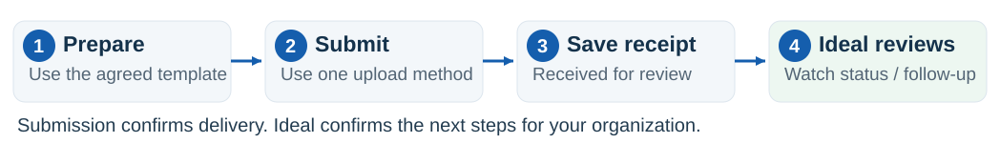
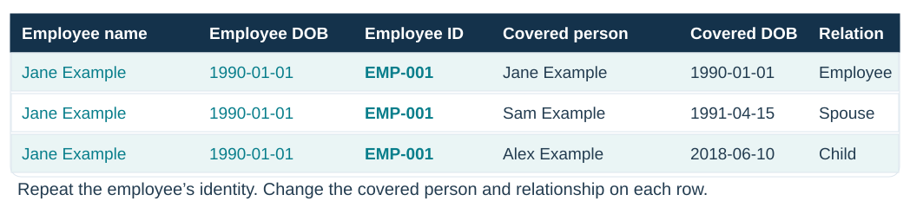
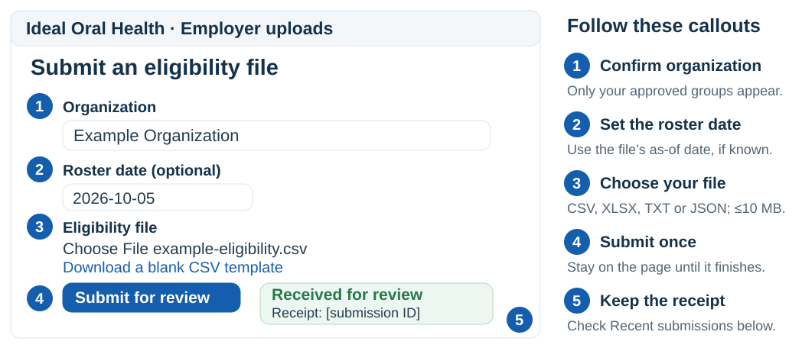

# Organization submission guide

Ideal Oral Health · October 5, 2026 · Share with employers, brokers, and payroll contacts

## Send your eligibility roster

Your guide to preparing a file, submitting it to Ideal, and checking what happens next.

### Start with the upload portal

[**https://www.getidealoh.com/employer/upload**](https://www.getidealoh.com/employer/upload)

Use the email address Ideal approved for your organization. Creating an account alone does not give upload access.

### Your upload details · Ideal completes before sharing

- **Organization:** ______________________________
- **Approved contact / sender email:** ______________________________
- **Assigned organization email address (if enabled):** ______________________________
- **Program Manager / support contact:** ______________________________
- **Agreed submission schedule:** ______________________________
- **Agreed review turnaround:** ______________________________

Your delivery receipt confirms that the file reached the review queue. It does not confirm member coverage or benefit activation.

| Option | Use it when |
| --- | --- |
| Browser portal | You want a guided upload and recent submission history. Recommended for manual submissions. |
| Email attachments | Ideal enabled your sender address and provided an organization-specific recipient address. |
| Automated HTTPS upload | Your payroll/HR team arranged an organization credential and technical setup with Ideal. |

Use one delivery option per submission. Confirm enabled methods and your schedule with Ideal.

## Prepare a clean roster

Download the blank CSV template from the portal, or use the file layout agreed with your Program Manager.

Fictitious example. Names are combined for readability; the CSV template has separate first-name and last-name columns.

1. **Use one row per covered person.** Enter Employee, Spouse, or Child in **Covered Member Relationship**. Repeat the employee’s first/last name, Employee DOB and Employee ID on each family row; enter each covered person’s own name and DOB.
2. **Keep identifiers and dates consistent.** A stable Employee ID helps match updates to the same person. Keep headers unchanged. Use YYYY-MM-DD dates, such as 2026-10-05. Preserve leading zeros in identifiers and ZIP codes. The blank template does not ask for SSNs.
3. **Check the whole file.** Confirm expected employee and dependent counts, names, birth dates and the agreed contact/address fields. Confirm effective dates with your Program Manager. Keep each family together when splitting files.
4. **Save in an accepted format.** CSV, XLSX, TXT or JSON; maximum 10 MB per file. A recognized extension alone does not guarantee the layout can be processed. Avoid macros and encrypted/password-protected workbooks. Use UTF-8 when exporting CSV or other text.

### For removals and changes

Tell your Program Manager about terminations through the agreed process. Leaving someone out of a new roster, or filling Term Date, does not automatically terminate their membership.

Suggested filename: Example-Org_Eligibility_2026-10-05.csv. Use your organization name and roster date; avoid member names, birth dates or other personal details in filenames.

## Upload in the browser

Sign in with your approved email, choose the correct organization, and keep the receipt.

Illustrated walkthrough with example data. Use the labels on your live screen; its appearance may vary.

1. **Sign in and verify your email.** Open the portal. Create an account if needed and complete email verification. If no organization appears, ask your Program Manager to confirm the approved address, then use **check access again**.
2. **Choose and submit.** Confirm Organization. Add the optional Roster date if you know the file’s as-of date. Choose your file, then click **Submit for review**. Wait for the receipt before leaving the page.
3. **Check Recent submissions.** Keep the receipt ID for follow-up. Submitted means awaiting review. Approved; awaiting processing means Ideal accepted the file but has not started the import. Completed refers to the import; Ideal confirms benefit and access next steps separately.

### “This file was already received.”

Keep the existing receipt and check its status. You do not need to upload the same file by another method. For a correction, submit a corrected file. Use the true roster date rather than changing it to force another submission.

Rejected: correct and resubmit. Expired: unreviewed after 30 days; contact your Program Manager about resubmitting.

## Email, automation & help

Choose the delivery method enabled by Ideal, then confirm the submission was received.

This address is an illustration. Copy the actual assigned address from your onboarding card, the portal, or your Program Manager.

1. **For email, use your approved sender.** Attach the original file to a new message from the exact address Ideal approved. Use the full assigned recipient, including the +org-… portion. Do not send only to the plain eligibility@ mailbox. Avoid forwarding another person’s message or sending from a different shared/group address unless Ideal approved it.
2. **Send attachments, then check for a receipt.** At most five supported attachments per message, each up to 10 MB; your email provider’s message limit also applies. Use a subject such as “Example Organization — eligibility roster — 2026-10-05.” Do not put member details in the subject/body or send cloud-drive links instead of attachments. Email is checked periodically; allow a few minutes.
3. **No receipt? Check before resending.** Check Recent submissions if you have portal access. If the file appears, keep that receipt even if the email reply is missing. Otherwise confirm sender, assigned recipient, file size and format; use the portal or ask your Program Manager for help. Refused email may receive no reply.

### If your payroll/HR system sends files automatically

Ask your Program Manager for automated HTTPS access and an organization-specific credential. Your IT team configures the endpoint and receipt checks with Ideal. Keep the credential in your secret store. This is HTTPS file delivery; an SFTP-only export needs a separately agreed connection.

### What to send when asking for help

Organization name, receipt ID if available, submission time/method, and the error message. Keep member data and credentials out of ordinary support messages. If Ideal needs a corrected roster, submit it through the approved intake method.

Completed with errors or Failed? Contact your Program Manager to confirm the next steps.

