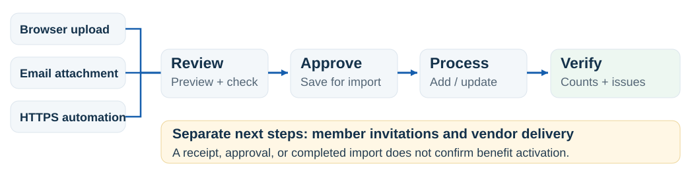
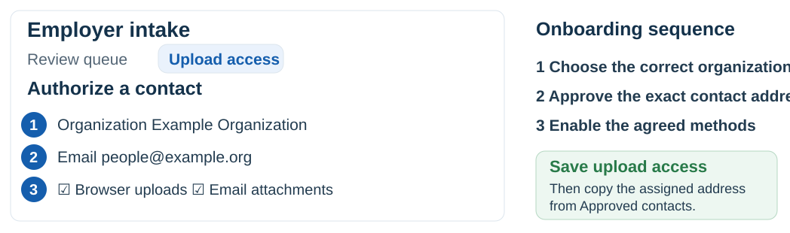
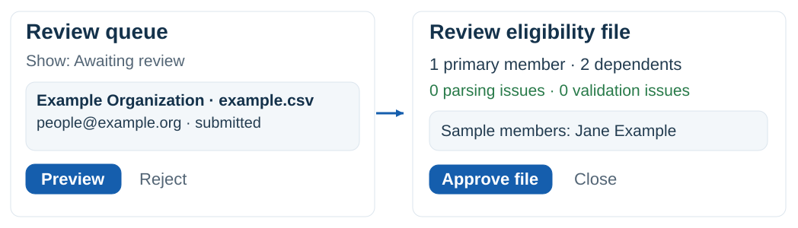
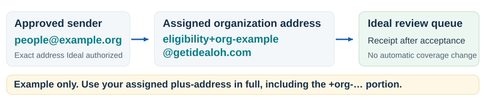

# Program Manager companion guide

Ideal Oral Health · October 5, 2026 · Internal operational guide

## Run eligibility intake

A practical companion for onboarding organizations, reviewing rosters, and verifying the next steps.

### Start here

Open [**Operations → Employer Intake**](https://www.getidealoh.com/admin/eligibility/intake). Intake is the delivery and review stage; invitations and vendor fulfillment remain separate.

The shared workflow. Browser, Google Workspace email, and automated HTTPS submissions enter the same review queue.

| Owner | What they do |
| --- | --- |
| Organization contact | Prepares the agreed roster, submits it, keeps the receipt, and corrects source data. |
| Program Manager / authorized staff | Authorizes contacts, checks counts and organization, approves or rejects, starts processing, and verifies outcomes. |
| Technical administrator | Keeps sign-in, the Gmail intake script, and automation available; manages technical setup and credential issues. |

### Four milestones to keep separate

**Received → approved → processed → invited / delivered.** None is a substitute for confirmation of the next milestone.

Agree a submission cadence, roster format, review turnaround, and exception contact with each organization. These are program arrangements; the system does not set a review SLA.

## Onboard an organization

Give each contact only the organizations and delivery methods they need.

Illustrated UI with fictitious data. Save the contact, then use Approved contacts to obtain the assigned email address.

1. **Check the destination.** The organization and its site must be active; its account must be active or onboarding. Set its Organization Code in Hierarchy before approving a roster.
2. **Authorize the exact email.** In **Upload access → Authorize a contact**, choose Organization, enter Email, select Browser uploads and/or Email attachments from this exact address, then click **Save upload access**.
3. **Share the upload details.** Send the portal link, approved sign-in/sender address, template, assigned email address if enabled, agreed cadence, and your support contact. Complete the onboarding card in the Organization guide.
4. **Verify the first submission.** Ask for a fictitious test roster first. Browser users must verify their approved sign-in email. Email-only contacts do not need a portal account to send; enable browser access if they need portal history.

### Brokers and contact changes

Authorize each organization separately for a broker. Revoke the old contact when staff change; revocation also invalidates unfinished upload sessions. Reassigned email addresses may require a technical access reset. Do not share a former contact’s login.

## Review before approval

Check the destination and roster before allowing member records to change.

Illustration, not a live screenshot. The review dialog uses the exact Preview and Approve file labels.

1. **Find the submission.** Use **Review queue → Show: Awaiting review**. It shows up to 100 oldest pending submissions. Confirm organization, sender, filename, roster date if supplied, and receipt ID.
2. **Preview and compare.** Click **Preview**. Compare primary and dependent counts with the organization’s expected totals. Check sample members and the displayed parsing and validation issues. Intake allows files up to 10 MB; the importer caps files at 10,000 primaries.
3. **Resolve issues or approve deliberately.** Zero primaries, parsing issues, or the member limit block approval. Request a corrected source file when needed. Missing-field warnings require the explicit acknowledgement checkbox; accept them only after assessing effects on invitations and vendor fulfillment.
4. **Approve or reject.** Click **Approve file** to create the linked Eligibility Files record. Or click **Reject**, enter a reason visible to the organization, and confirm **Reject and delete attachment**. Rejection schedules source-file deletion.

### After approval, change the filter

The approved row leaves Awaiting review. Switch **Show → Latest 100 submissions** to find **Process approved file**. Use Eligibility Files to follow an older approved file.

Suggested rejection note: “Please use the agreed template and include a birth date for each employee. Upload a corrected file for review.” Keep names, birth dates, and other member details out of review notes.

## Process and verify

Finish the import, then decide which follow-up actions the program needs.

1. **Start the approved import.** In Latest 100 submissions, click **Process approved file**. Processing starts separately from approval. Follow the processing status or open **Eligibility Files**.
2. **Verify counts and errors.** At [**Eligibility Files**](https://www.getidealoh.com/admin/eligibility), find the linked upload in Upload History. Check final status, new/updated counts, and row issues. Spot-check a few members in the correct organization. A partial result needs review before closing the task.
3. **Grant member access when appropriate.** On the processed file’s row, click **Grant Access**. Review the member list, select the members ready to invite, then click **Send invite to N member(s)**. Members without email cannot be invited through this action. Confirm the invitation result.
4. **Coordinate vendor delivery.** Follow Ideal’s vendor delivery procedure. A generated/downloaded file is not proof of delivery. Confirm the actual send result or vendor receipt before telling the organization that fulfillment is complete.

| Processing status | Program Manager action |
| --- | --- |
| uploaded | Approved; awaiting processing. Start the import when ready. |
| validating / processing | In progress. Monitor; avoid starting a second import. |
| completed | Import finished. Check counts and any reported issues before follow-up. |
| completed_with_errors | Review row issues; some members may have been imported. Correct affected data. |
| failed | Investigate first. Retry processing after the cause is fixed; escalate persistent failures. |

### Removals are a separate workflow

Omitting a person from a roster does not terminate them. Term Date is not an automated termination instruction in this importer. Follow the approved member-status procedure; address billing and vendor updates separately where applicable.

## Email and automation

Use the assigned address; keep mailbox and automation operations with the technical owner.

Current email intake runs in the dedicated Google Workspace eligibility mailbox. The alias shown here is fictitious.

### What to tell organizations

Email the original attachment from the exact approved sender to the complete assigned plus-address. The plain eligibility@getidealoh.com mailbox address does not identify an organization. Use one organization’s alias per submission. Supported attachments: CSV, XLSX, TXT or JSON; at most five supported attachments, each ≤10 MB. Gmail’s overall message limits still apply.

### Email is checked periodically

When installed, the Gmail script is scheduled every five minutes. Accepted files enter the queue and the sender is emailed a receipt; this is not an instantaneous delivery or review promise. Gmail filtering and sender-domain authentication are required. Forwarded messages, group mail, or unapproved senders can be refused without a reply.

### If receipt delivery looks wrong

Check Ideal’s queue before asking for another upload. A receipt email can fail even after the file is received. Confirm the sender and exact alias. If email fails for several organizations, escalate to the technical owner to check the Gmail script’s trigger/executions and mailbox. A “settings present” message in the admin screen does not confirm that the script is running.

### For payroll automation

In Upload access, create an automated upload credential for one organization, with a descriptive label and 1–365 day expiry. Copy it once and share through the approved secure channel. The technical owner supplies the HTTPS endpoint/client instructions. Rotate by creating a replacement, updating the job, then revoking the old key.

### Keep the inbox purpose-specific

The dedicated eligibility mailbox is for file intake. Handled or refused messages are moved to Trash; Gmail normally purges Trash after 30 days. Do not use it for human support conversations.

## Daily reference & handoff

A short operating routine and a message you can adapt for every organization.

| Check | Action |
| --- | --- |
| Each workday | Review pending files; compare counts; resolve corrections; process approved files; follow exceptions to closure. |
| No organization / no access | Verify the approved email and organization grant. Ask the user to verify that email and check access again. |
| Rejected / expired | Explain the correction or expiry; request a fresh submission. Unreviewed source files expire after 30 days. |
| Already received | Find the existing receipt. Do not change dates merely to force a duplicate import. |
| Vendor ID belongs to another organization | Stop and verify the roster with the sender; escalate the ID conflict. Do not bypass organization isolation. |
| Failed automation | Check expiry/revocation, file size and format. Involve the technical owner; do not ask for keys in email. |

### Welcome message · replace every bracketed field

**Subject:** [Organization] eligibility submission instructions

Your approved contact address is [email]. Submit your roster at [https://www.getidealoh.com/employer/upload](https://www.getidealoh.com/employer/upload). [If enabled: You may also attach the file to [assigned organization email address].]

Use the attached blank CSV template or the format agreed with Ideal. Send files up to 10 MB. Our agreed schedule is [cadence]; the review turnaround is [agreed turnaround]. Keep your submission receipt.

A receipt confirms delivery for review. Ideal will confirm any corrections and next steps. Send questions to [Program Manager contact], using your organization name and receipt ID; keep member information out of the subject and message body.

Retention and handling: rejected attachments are deleted; pending files expire after 30 days. Approved files follow Ideal’s separate retention policy. Handle downloaded rosters through the approved data-handling process.

